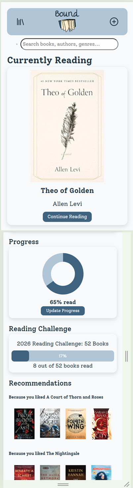
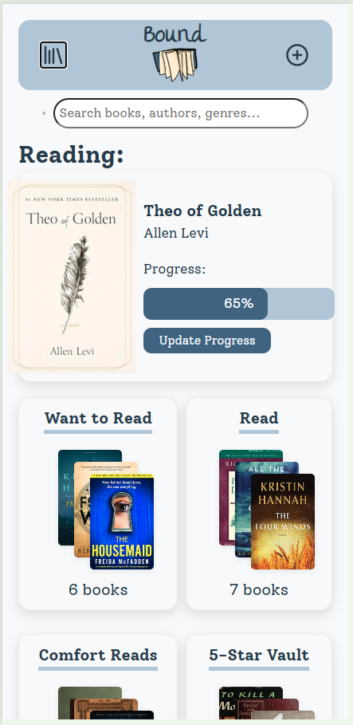
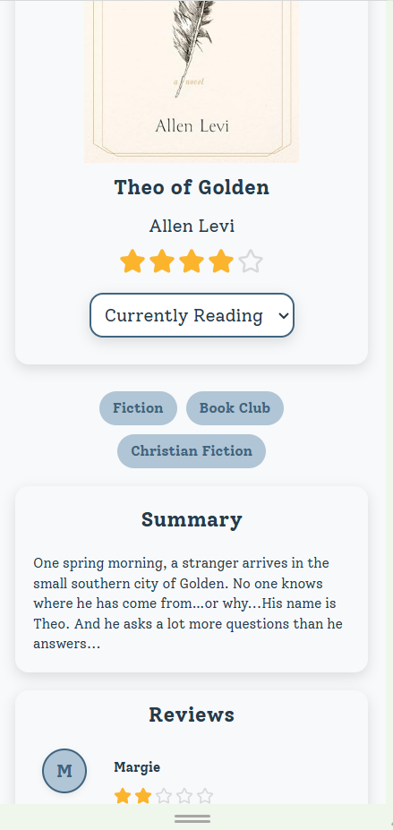
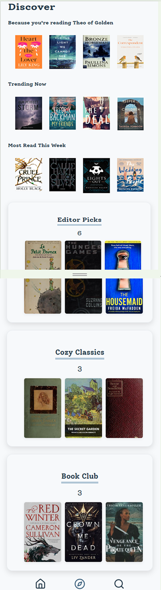

# Bound

Bound is a mobile-first designed personal reading tracker built with React. The goal of the project is to help readers organize their library, track reading progress, explore recommendations, and discover new books.

**WORK IN PROGRESS**

## Live Demo
[View Live Demo](https://bound-app-omega.vercel.app/)

## Screenshots

### Home

Tracks reading progress, current reads, and provides personalized recommendations based on recent activity.

### Library

Organizes books into dynamic shelves that update automatically based on reading status.

### Book Details

Provides detailed information for individual books, including the reading status set by the user, summary and metadata of the book, and ratings and reviews by other users. 

### Discover

Displays generalized recommendations based on current trends, personal recent activity of the user, as well as special featured lists. 

## Current Status

### Work in Progress

This project is actively being developed and is not considered feature-complete. This repository is intended to demonstrate my development process, architectural decisions, and growing React skills rather than serve as a finished production application. 

### Responsive Design Status

This application was designed using a mobile-first approach and is currently optimized for smaller screen sizes. Responsive layouts for tablet and desktop breakpoints are still being refined as development continues. Part of this ongoing development process includes improving responsiveness, layout consistency, and overall user experience across a wider range of devices and screen sizes. 

## Features Currently Implemented

- Home dashboard
- Reading progress tracking
- Progress update modal
- Local storage persistence
- Library shelves
- Dynamic shelf management
- Book details pages
- Genre browsing
- Search functionality
- Featured reading lists
- React router navigation
- Response mobile-first layout

## Technologies
- React
- React Router
- JavaScript (ES6+)
- CSS
- Vite
- Local Storage API
- Open Library API

## Current Development Goals
Planned improvements include: 
- Enhanced search and filtering
- Reading challenges
- Featured list improvements
- Book management workflows
- Improved accessibility
- Additional user interactions and polish

## Design Goals
This project was designed as a mobile-first reading application focused on: 
- Clean and intuitive navigation
- Reusable component architecture
- Maintainable state management
- Progressive feature development
- Strong user experience fundamentals

## Note
This repository represents an ongoing learning and development project. Features, architecture, and UI will continue to evolve as new functionality and responsiveness is added and existing systems are refined. 
